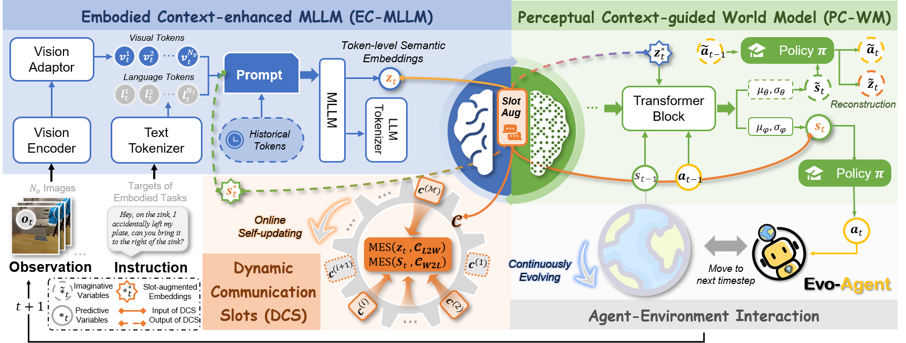

# Building Embodied EvoAgent: A Brain-inspired Paradigm for Bridging Multimodal Large Models and World Models

**Junyu Gao, Xuan Yao, Yong Rui and Changsheng Xu**

> Embodied artificial intelligence has rapidly developed under the impetus of multimodal learning, robotics, and cognitive science, demonstrating great potential in fields such as navigation and manipulation. However, building embodied agents that can robustly operate in diverse and dynamic environments still faces challenges, such as handling partial observability and environmental adaptability. Multimodal large language models (MLLMs) are vital for embodied intelligence due to their ability to process multimodal information, but they encounter difficulties in understanding spatial environments and performing dynamic decisions and evolution. Inspired by the functional specialization of the left and right hemispheres of the human brain, this paper proposes a brain-inspired learning and evolution paradigm for embodied agents. The method designs an embodied context-augmented MLLM to simulate the language processing and logical analysis capabilities of the left hemisphere, responsible for understanding instructions and visual scenes. At the same time, it constructs a perceptual context-guided world model based on the recurrent state space model to simulate the spatial perception and holistic thinking functions of the right hemisphere, capturing environmental dynamics and predicting future states. By simulating the communication function of the corpus callosum, we propose dynamic communication slots for efficient information exchange between MLLMs and the world model, which also allows the agent to quickly adapt to dynamic environments without requiring extensive computational resources. Experiments show that the proposed paradigm significantly improves the performance of embodied agents in a series of tasks and enhances their generalization ability in zero-shot tasks through embodied exploration experience and online evolution.



## Acknowledgments
Parts of this project page were adopted from the [Academic Project Page Template]([https://nerfies.github.io/](https://github.com/eliahuhorwitz/Academic-project-page-template?tab=readme-ov-file) page.

## Citation
If you find this project useful in your research, please consider cite:
```
@inproceedings{Gao_2025_EvoAgent,
        author    = {Junyu Gao, Xuan Yao, Yong Rui and Changsheng Xu},
        title     = {Building Embodied EvoAgent: A Brain-inspired Paradigm for Bridging Multimodal Large Models and World Models},
        booktitle = {Proceedings of the 33rd ACM International Conference on Multimedia (ACM MM)},
        year      = {2025},
}
```

## Website License
<a rel="license" href="http://creativecommons.org/licenses/by-sa/4.0/"></a><br />This work is licensed under a <a rel="license" href="http://creativecommons.org/licenses/by-sa/4.0/">Creative Commons Attribution-ShareAlike 4.0 International License</a>.
